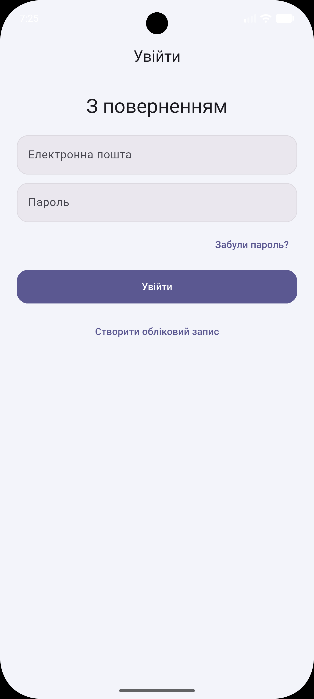

# BookShelf

A modern, feature-rich Flutter application for book enthusiasts. Search through millions of books, track your reading progress, and maintain your personal digital library with ease.

## Tech Stack

| Technology | Version | Purpose |
| :--- | :--- | :--- |
| **Flutter** | 3.24+ | UI Framework |
| **Riverpod** | 2.6+ | State Management |
| **Firebase** | Latest | Auth, Firestore, Storage |
| **GoRouter** | Latest | Navigation |
| **Architecture** | Clean | Feature-first organization |
| **API** | [Open Library](https://openlibrary.org/developers/api) | Book Metadata |

---

## Getting Started

### Prerequisites
- Flutter SDK (latest stable version)
- Dart SDK
- A Firebase project (configured for Android/iOS/Web)

### Setup
1.  **Clone the repository**:
    ```bash
    git clone https://github.com/your-username/bookshelf.git
    cd bookshelf
    ```
2.  **Install dependencies**:
    ```bash
    flutter pub get
    ```
3.  **Configure Firebase**:
    - Use [FlutterFire CLI](https://firebase.google.com/docs/flutter/setup) to configure your Firebase project:
      ```bash
      flutterfire configure
      ```
4.  **Run the app**:
    ```bash
    flutter run
    ```

---

## How to Use

### 1. Authentication
When you first open the app, you'll be greeted by the Login screen. You can create a new account, sign in, or reset your password.

<div align="center">

| Login Screen |
| :---: |
|  |

</div>

---

### 2. Discovering Books (Home Screen)
The Home screen is your starting point. Browse **Trending Today** books, explore **Popular Categories**, or use the search bar.

<div align="center">

| Home & Trending |
| :---: |
|  |

</div>

---

### 3. Search Results & Details
Search by title or author. Tap on any book to see its full description, publication year, and subjects with smooth **Hero Animations**.

<div align="center">

| Search Results | Book Details |
| :---: | :---: |
|  |  |

</div>

---

### 4. Personal Library
Manage your books in the "My Library" tab. Categorize them as **Reading**, **Read**, or **Want to read**. Track your progress and leave ratings.

<div align="center">

| My Library | Editing Progress |
| :---: | :---: |
|  |  |

</div>

---

### 5. Profile & Settings
Customize your experience. Upload a profile photo, view reading stats, change the language, or toggle themes.

<div align="center">

| Profile Screen | Settings / Language |
| :---: | :---: |
|  |  |

</div>

---

## Theme & Localization Support

The app fully supports **Light** and **Dark** modes, along with localization for **English**, **Ukrainian**, and **Polish**.

<div align="center">

| Dark: Home | Dark: Library | Dark: Profile |
| :---: | :---: | :---: |
|  |  |  |

</div>

---

## Features Implementation Details

-   **Clean Architecture**: Features are organized into Domain, Data, and Presentation layers.
-   **Animations**: Uses `Hero` animations for covers and `FadeInAnimation` for staggered list items.
-   **Testing**: Includes 13 Unit Tests and 4 Widget Tests for core logic and UI components.

Run tests using:
```bash
flutter test
```
